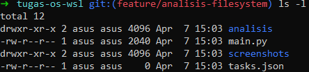
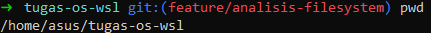

# Analisis Filesystem

## Screenshot

## Jawaban Pertanyaan Analitis
Permission -rw-r--r-- berarti owner bisa read+write, group
hanya read, others hanya read. OS menggunakan permission bits
sebagai mekanisme access control — setiap file I/O di-validasi
kernel berdasarkan UID proses yang mengaksesnya.
