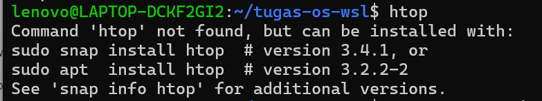
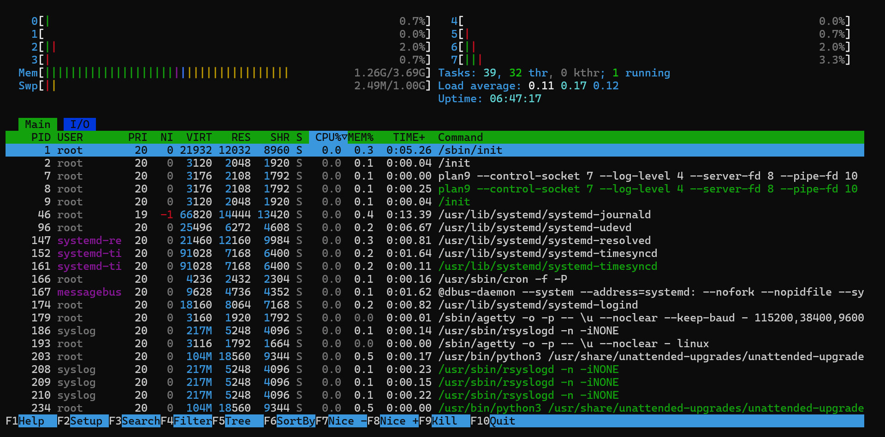

# Analisis Memory

## Screenshot

## Jawaban Pertanyaan Analitis
OS mengalokasikan memory untuk proses menggunakan virtual memory
management. Saat aplikasi Python dijalankan, interpreter
membutuhkan memory untuk stack, heap, dan code segment.
