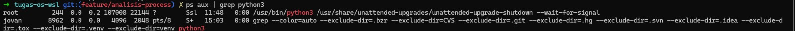
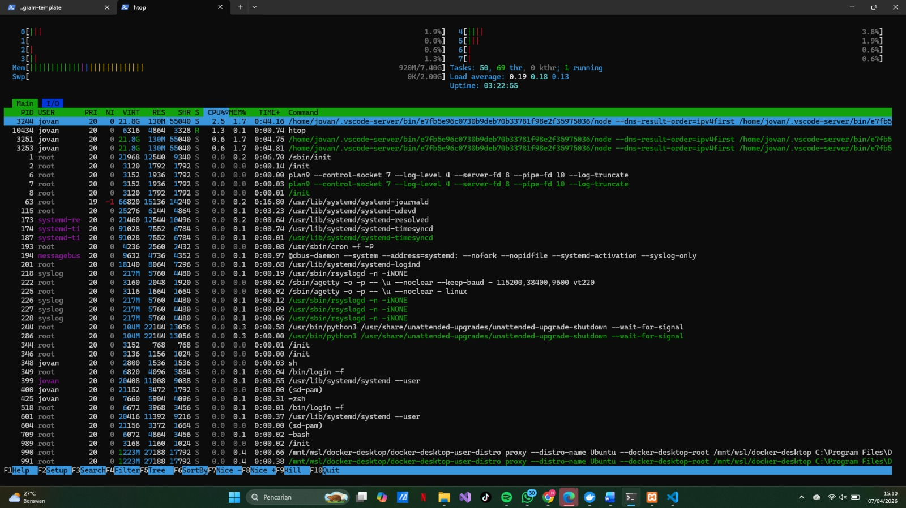

# Analisis Process

## Screenshot

## Jawaban Pertanyaan Analitis
Sistem operasi merepresentasikan aplikasi sebagai sebuah proses
dengan PID unik. PID digunakan kernel untuk melacak resource
yang digunakan proses tersebut. CPU usage rendah (%CPU ~0.0)
menunjukkan proses sedang sleeping/waiting, bukan actively
executing.
