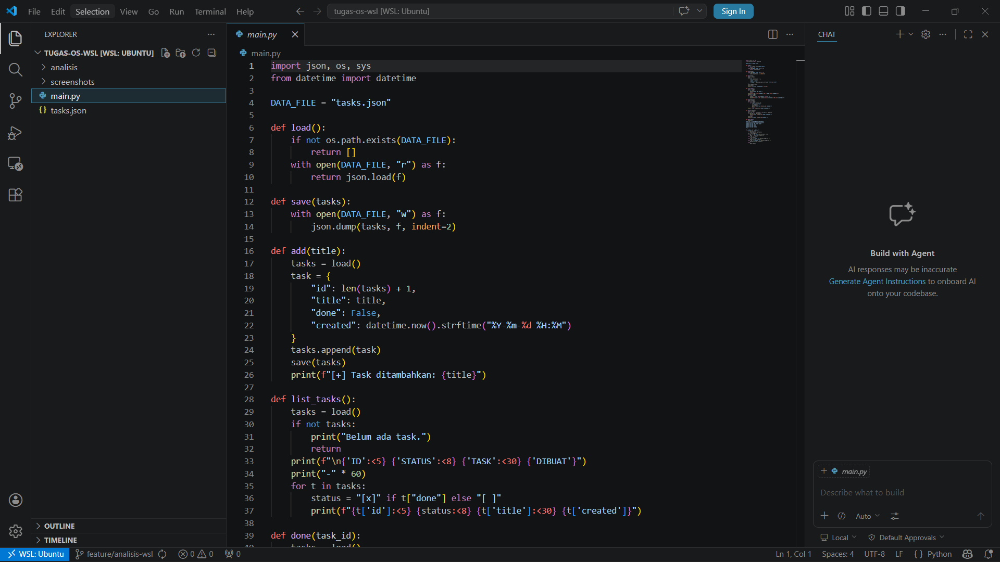

# Analisis WSL & VS Code

## Screenshot

## Jawaban Pertanyaan Analitis WSL
WSL memungkinkan Linux berjalan di atas Windows melalui lapisan
abstraksi. WSL2 menggunakan lightweight VM dengan Linux kernel
asli. Layer: hardware → Windows NT kernel → Hyper-V → WSL2
Linux kernel → proses user.

## Jawaban Pertanyaan Analitis VS Code
Integrasi VS Code + WSL memungkinkan development di environment
Linux tanpa meninggalkan Windows. Keuntungan: akses langsung ke
filesystem Linux, terminal WSL terintegrasi, extension berjalan
di Linux. Keterbatasan: perlu install VS Code di Windows dulu.
